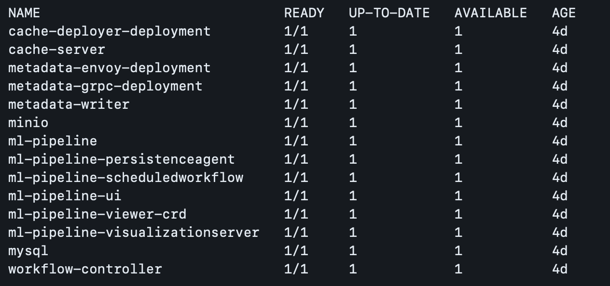

### 1. Install Docker

To install Docker, follow the instructions provided in the [official Docker documentation](https://docs.docker.com/get-docker/).

### 2. Install Installing Kind (Kubernetes in Docker) 
kind is a tool for running local Kubernetes clusters using Docker container “nodes”.
kind was primarily designed for testing Kubernetes itself, but may be used for local development or CI.

For detailed installation instructions and troubleshooting, refer to the [official Kind documentation](https://kind.sigs.k8s.io/docs/user/quick-start#installation).


### 3. Create Kubernetes cluster using Docker containers

When you run kind create cluster, Kind performs the following steps:

1. It sets up a new Kubernetes cluster using Docker containers as "nodes".
2. It creates a new Docker container for each Kubernetes node (master and worker nodes).
3. It configures networking between the containers to simulate a multi-node Kubernetes cluster.
4. It installs the necessary Kubernetes components inside the containers, such as kubelet, kube-proxy, and etcd.
5. Finally, it sets up kubeconfig files and context to allow kubectl to interact with the newly created Kind cluster.

To create a Kubernetes cluster using Kind, execute the following command:

```
kind create cluster
```

Output look like this 
```
% kind create cluster
Creating cluster "kind" ...
 ✓ Ensuring node image (kindest/node:v1.29.2) 🖼 
 ✓ Preparing nodes 📦  
 ✓ Writing configuration 📜 
 ✓ Starting control-plane 🕹️ 
 ✓ Installing CNI 🔌 
 ✓ Installing StorageClass 💾 
Set kubectl context to "kind-kind"
You can now use your cluster with:

kubectl cluster-info --context kind-kind

Have a nice day! 👋
```
```
% kubectl cluster-info --context kind-kind
Kubernetes control plane is running at https://127.0.0.1:49461
CoreDNS is running at https://127.0.0.1:49461/api/v1/namespaces/kube-system/services/kube-dns:dns/proxy

To further debug and diagnose cluster problems, use 'kubectl cluster-info dump'.
```


### 4. Deploy Kubeflow Pipelines

You can enter the commands above one line at a time. These will setup all the deployments and spin up the pods for the entire application. These will be found in the kubeflow namespace. After sending the last command, it will take a moment (around 30 minutes) for all the deployments to be ready. 

```
export PIPELINE_VERSION=1.8.5
kubectl apply -k "github.com/kubeflow/pipelines/manifests/kustomize/cluster-scoped-resources?ref=$PIPELINE_VERSION"
kubectl wait --for condition=established --timeout=300s crd/applications.app.k8s.io
kubectl apply -k "github.com/kubeflow/pipelines/manifests/kustomize/env/platform-agnostic-pns?ref=$PIPELINE_VERSION"
```

Output look like this:
```
# Warning: 'bases' is deprecated. Please use 'resources' instead. Run 'kustomize edit fix' to update your Kustomization automatically.
# Warning: 'vars' is deprecated. Please use 'replacements' instead. [EXPERIMENTAL] Run 'kustomize edit fix' to update your Kustomization automatically.
# Warning: 'bases' is deprecated. Please use 'resources' instead. Run 'kustomize edit fix' to update your Kustomization automatically.
namespace/kubeflow created
customresourcedefinition.apiextensions.k8s.io/applications.app.k8s.io created
customresourcedefinition.apiextensions.k8s.io/clusterworkflowtemplates.argoproj.io created
customresourcedefinition.apiextensions.k8s.io/cronworkflows.argoproj.io created
customresourcedefinition.apiextensions.k8s.io/scheduledworkflows.kubeflow.org created
customresourcedefinition.apiextensions.k8s.io/viewers.kubeflow.org created
customresourcedefinition.apiextensions.k8s.io/workfloweventbindings.argoproj.io created
customresourcedefinition.apiextensions.k8s.io/workflows.argoproj.io created
customresourcedefinition.apiextensions.k8s.io/workflowtaskresults.argoproj.io created
customresourcedefinition.apiextensions.k8s.io/workflowtasksets.argoproj.io created
customresourcedefinition.apiextensions.k8s.io/workflowtemplates.argoproj.io created
serviceaccount/kubeflow-pipelines-cache-deployer-sa created
clusterrole.rbac.authorization.k8s.io/kubeflow-pipelines-cache-deployer-clusterrole created
clusterrolebinding.rbac.authorization.k8s.io/kubeflow-pipelines-cache-deployer-clusterrolebinding created
customresourcedefinition.apiextensions.k8s.io/applications.app.k8s.io condition met
# Warning: 'bases' is deprecated. Please use 'resources' instead. Run 'kustomize edit fix' to update your Kustomization automatically.
# Warning: 'patchesStrategicMerge' is deprecated. Please use 'patches' instead. Run 'kustomize edit fix' to update your Kustomization automatically.
# Warning: 'bases' is deprecated. Please use 'resources' instead. Run 'kustomize edit fix' to update your Kustomization automatically.
# Warning: 'bases' is deprecated. Please use 'resources' instead. Run 'kustomize edit fix' to update your Kustomization automatically.
# Warning: 'vars' is deprecated. Please use 'replacements' instead. [EXPERIMENTAL] Run 'kustomize edit fix' to update your Kustomization automatically.
# Warning: 'bases' is deprecated. Please use 'resources' instead. Run 'kustomize edit fix' to update your Kustomization automatically.
# Warning: 'bases' is deprecated. Please use 'resources' instead. Run 'kustomize edit fix' to update your Kustomization automatically.
# Warning: 'patchesJson6902' is deprecated. Please use 'patches' instead. Run 'kustomize edit fix' to update your Kustomization automatically.
# Warning: 'bases' is deprecated. Please use 'resources' instead. Run 'kustomize edit fix' to update your Kustomization automatically.
# Warning: 'patchesStrategicMerge' is deprecated. Please use 'patches' instead. Run 'kustomize edit fix' to update your Kustomization automatically.
I0511 01:58:51.356595    1968 log.go:245] well-defined vars that were never replaced: kfp-app-name,kfp-app-version
serviceaccount/argo created
serviceaccount/kubeflow-pipelines-cache created
serviceaccount/kubeflow-pipelines-container-builder created
serviceaccount/kubeflow-pipelines-metadata-writer created
serviceaccount/kubeflow-pipelines-viewer created
serviceaccount/metadata-grpc-server created
serviceaccount/ml-pipeline created
serviceaccount/ml-pipeline-persistenceagent created
serviceaccount/ml-pipeline-scheduledworkflow created
serviceaccount/ml-pipeline-ui created
serviceaccount/ml-pipeline-viewer-crd-service-account created
serviceaccount/ml-pipeline-visualizationserver created
serviceaccount/mysql created
serviceaccount/pipeline-runner created
role.rbac.authorization.k8s.io/argo-role created
role.rbac.authorization.k8s.io/kubeflow-pipelines-cache-deployer-role created
role.rbac.authorization.k8s.io/kubeflow-pipelines-cache-role created
role.rbac.authorization.k8s.io/kubeflow-pipelines-metadata-writer-role created
role.rbac.authorization.k8s.io/ml-pipeline created
role.rbac.authorization.k8s.io/ml-pipeline-persistenceagent-role created
role.rbac.authorization.k8s.io/ml-pipeline-scheduledworkflow-role created
role.rbac.authorization.k8s.io/ml-pipeline-ui created
role.rbac.authorization.k8s.io/ml-pipeline-viewer-controller-role created
role.rbac.authorization.k8s.io/pipeline-runner created
rolebinding.rbac.authorization.k8s.io/argo-binding created
rolebinding.rbac.authorization.k8s.io/kubeflow-pipelines-cache-binding created
rolebinding.rbac.authorization.k8s.io/kubeflow-pipelines-cache-deployer-rolebinding created
rolebinding.rbac.authorization.k8s.io/kubeflow-pipelines-metadata-writer-binding created
rolebinding.rbac.authorization.k8s.io/ml-pipeline created
rolebinding.rbac.authorization.k8s.io/ml-pipeline-persistenceagent-binding created
rolebinding.rbac.authorization.k8s.io/ml-pipeline-scheduledworkflow-binding created
rolebinding.rbac.authorization.k8s.io/ml-pipeline-ui created
rolebinding.rbac.authorization.k8s.io/ml-pipeline-viewer-crd-binding created
rolebinding.rbac.authorization.k8s.io/pipeline-runner-binding created
configmap/kfp-launcher created
configmap/metadata-grpc-configmap created
configmap/ml-pipeline-ui-configmap created
configmap/pipeline-install-config created
configmap/workflow-controller-configmap created
secret/mlpipeline-minio-artifact created
secret/mysql-secret created
service/cache-server created
service/metadata-envoy-service created
service/metadata-grpc-service created
service/minio-service created
service/ml-pipeline created
service/ml-pipeline-ui created
service/ml-pipeline-visualizationserver created
service/mysql created
service/workflow-controller-metrics created
priorityclass.scheduling.k8s.io/workflow-controller created
persistentvolumeclaim/minio-pvc created
persistentvolumeclaim/mysql-pv-claim created
deployment.apps/cache-deployer-deployment created
deployment.apps/cache-server created
deployment.apps/metadata-envoy-deployment created
deployment.apps/metadata-grpc-deployment created
deployment.apps/metadata-writer created
deployment.apps/minio created
deployment.apps/ml-pipeline created
deployment.apps/ml-pipeline-persistenceagent created
deployment.apps/ml-pipeline-scheduledworkflow created
deployment.apps/ml-pipeline-ui created
deployment.apps/ml-pipeline-viewer-crd created
deployment.apps/ml-pipeline-visualizationserver created
deployment.apps/mysql created
deployment.apps/workflow-controller created
```

You can send the command ` kubectl get deploy -n kubeflow ` a few times to check the status. You should see all deployments with the READY status before you can proceed to the next section.
```
kubectl get deploy -n kubeflow
```


Output will look like this 



